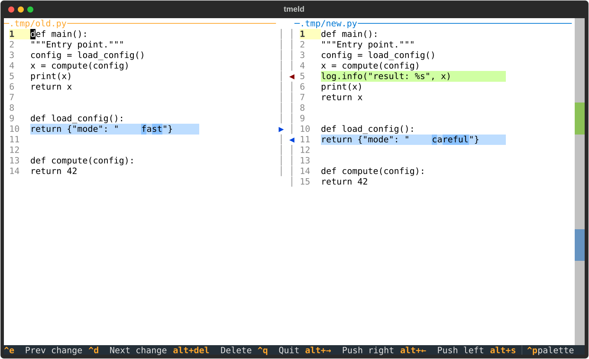

# tmeld — Meld, in your terminal

[](https://github.com/mitnits/tmeld/actions/workflows/ci.yml)
[](LICENSE)

A faithful terminal port of [GNOME Meld](https://meld.app/): the same
diff engine (vendored verbatim), the same colors, the same keybindings —
over plain SSH. Two- and three-way file comparison and merging, folder
comparison, and a version-control view.



```
tmeld a.py b.py                  # 2-way compare/edit
tmeld local.py base.py remote.py # 3-way merge (middle = merged file)
tmeld dirA dirB                  # folder comparison (Enter opens files)
tmeld .                          # version-control view (git, hg, svn, ...)
tmeld a b --diff c d --diff x y  # extra comparison tabs (like meld --diff)
tmeld --theme meld-dark a b      # Meld's dark scheme
tmeld --show-line-numbers a b    # line numbers (off by default, as in Meld)
```

Line numbers are hidden by default, matching Meld's defaults; the status bar
always shows `Ln N, Col N` for the focused pane. `--show-line-numbers` brings
them back (in `bmeld` too).

## Installing

From PyPI: `pipx install tmeld` (or `pip install tmeld`).

As a Debian package: grab `tmeld_*_all.deb` from the GitHub release
and `sudo dpkg -i` it, or build it yourself with
`dpkg-buildpackage -us -uc -b` (needs network: the build bundles the
pinned Textual under `/usr/share/tmeld/lib`, since tmeld needs a newer
Textual than Debian ships; system Python packages are untouched).

## Keys (Meld's own)

| Action | Keys |
|---|---|
| Next / previous change | Alt+Down, Ctrl+D / Alt+Up, Ctrl+E |
| Push chunk left / right | Alt+Left / Alt+Right |
| Pull chunk from left / right | Alt+Shift+Right / Alt+Shift+Left |
| Copy chunk above / below | Alt+[ Alt+] / Alt+; Alt+' |
| Delete chunk | Alt+Delete |
| Next / previous conflict (3-way) | Ctrl+K / Ctrl+J |
| Merge all non-conflicting (3-way) | Alt+M |
| Undo / cut / copy | Ctrl+Z, Alt+Z / Ctrl+X, Alt+X / Ctrl+C, Alt+C |
| Save | Ctrl+S |
| Next / previous pane | Alt+PgDn / Alt+PgUp |
| Close tab | Ctrl+W (twice if unsaved) |
| Next / previous tab | Ctrl+Alt+PgDn / Ctrl+Alt+PgUp |
| Quit | Ctrl+Q |

Gutter arrows between panes are clickable (they push the chunk); the
right-edge map is click-to-jump. On macOS terminals, set "Option as
Esc+" (iTerm2: Profiles → Keys) so Alt bindings arrive.

In folder comparisons: Enter compares the file under the cursor (or
expands/collapses a folder), Alt+Left/Right copy the row to that
neighbor pane, Delete deletes it (press twice to confirm), Alt+Down/Up
jump between differing rows, and Alt+PgDn/PgUp move the focused pane
(the column copy/delete act on). Meld's default filename filters
(backups, VCS metadata, binaries, OS cruft) apply.

In the version-control view (`tmeld .` anywhere in a working copy):
Enter compares a changed file against the repository (repo side
read-only); a conflicted file opens as a remote/merge/local 3-way whose
middle-pane saves resolve the working file. `c` commits (Meld's Ctrl+M
IS Enter in a terminal, so the mnemonic moved), `r` reverts, Delete
deletes, Ctrl+R/F5 rescans.

## bmeld: Meld in your browser

`pip install 'tmeld[web]'` adds the `bmeld` command: it starts a local
server (127.0.0.1 only, token-protected) and prints a clickable URL —
the same engine, palette and keybindings, rendered by CodeMirror with
real SVG linkmap curves. Typing is local and instant; the server
rediffs debounced snapshots and is the only thing that writes files.
The process exits with the same mergetool contract as tmeld, so the
`.gitconfig` stanza below works with `cmd = bmeld ...` too.

```
bmeld local.py base.py remote.py   # prints http://127.0.0.1:PORT/t/TOKEN
bmeld dirA dirB                    # folder comparison (Enter opens files)
bmeld .                            # version-control view (commit/revert)
bmeld a b --diff c d               # extra comparison tabs
bmeld --port 8731 a.py b.py        # fixed port: add a LocalForward line
                                   # to ~/.ssh/config and remote links
                                   # open on your local browser
bmeld --bind 0.0.0.0 a.py b.py     # reachable from other machines (see below)
```

File, folder, and version-control comparisons open as tabs (with ✕
close buttons); Enter/double-click a tree row opens a file comparison.

Over SSH, bmeld prints the port-forward one-liner instead of trying to
open a browser. Sessions survive reloads; closing the tab without
saving a merge exits 1 after a grace period (`--grace`).

By default bmeld listens on loopback only. `--bind 0.0.0.0` accepts
connections from other machines and prints a URL with this host's
outbound address (override with `--advertise HOST`). Understand what
that costs: the unguessable token in the URL becomes the only thing
between the network and a process that reads and writes the files under
comparison, and it travels in cleartext over HTTP. Use it on a network
you trust, or keep the SSH tunnel.

## Pixel linkmap (Tier 2)

On terminals with graphics support, the gutter between panes widens
and Meld's anti-aliased connector curves are drawn there as real
pixels — kitty graphics protocol (kitty, WezTerm, Ghostty) or sixel
(iTerm2, recent VTE), auto-detected at startup. `--graphics
none|sixel|kitty` overrides the probe. Everything else stays
cell-based; without graphics you keep the compact 3-column gutter.

## git mergetool

tmeld follows Meld's convention: `tmeld $LOCAL $MERGED $REMOTE`, the
middle pane is the merged file. The exit code is 0 only if the middle
pane was saved, so git can trust it:

```ini
[merge]
    tool = tmeld
[mergetool "tmeld"]
    cmd = tmeld "$LOCAL" "$MERGED" "$REMOTE"
    trustExitCode = true
```

`tmeld -o OUTPUT local base remote` redirects middle-pane saves to
OUTPUT (like `meld -o`) if you'd rather keep the base file untouched.

For diffs: `git difftool -x tmeld` or

```ini
[diff]
    tool = tmeld
[difftool "tmeld"]
    cmd = tmeld "$LOCAL" "$REMOTE"
```

## License and provenance

GPL-2.0-or-later (see LICENSE), like Meld — whose engine this project
vendors byte-for-byte apart from mechanical import rewrites
(`tmeld/_vendor/meld/`, pinned commit recorded in
`tmeld/_vendor/UPSTREAM`, rewrites applied by `maint/vendor.py`). The
vendored `vc/` package is BSD 2-clause (its COPYING ships alongside).

tmeld is an independent project, not affiliated with or endorsed by
the Meld or GNOME projects. All credit for the diff engine and the
design this port imitates goes to [Meld](https://meld.app/) and its
maintainers.
